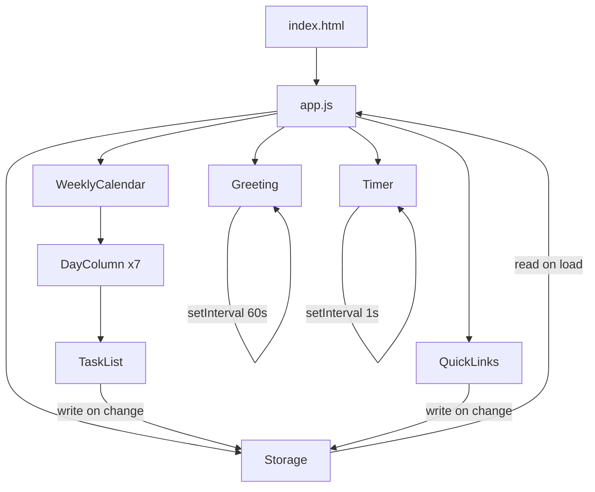

# Design Document: Personal Dashboard

## Overview

A single-page personal dashboard built with vanilla HTML, CSS, and JavaScript. No frameworks, no build tools, no backend. All state is persisted to `localStorage`. The app is delivered as three files:

- `index.html` — markup and component structure
- `css/style.css` — all styling
- `js/app.js` — all logic

The page is divided into two rows:

- **Row 1 (full width):** Greeting panel (left) + Weekly Calendar with per-day task lists (right)
- **Row 2:** Focus Timer (left column) + Quick Links (right column)

On load, `app.js` reads `localStorage`, hydrates the data models, then renders each component. After that, each component manages its own DOM mutations and writes back to `localStorage` on every change.

---

## Architecture



All modules live in `app.js` as plain functions and objects — no classes required, though a simple object-literal module pattern keeps concerns separated.

---

## Components and Interfaces

### Greeting

Responsibility: Display current time (HH:MM), current date (e.g. "Monday, July 14"), and a time-of-day message.

```
greeting.init(containerEl)
greeting.update()          // called by setInterval every 60 000 ms
```

- On `init`, renders the DOM structure and calls `update()` immediately.
- `update()` reads `new Date()`, formats time/date strings, determines the greeting phrase, and patches the relevant text nodes.

Time-of-day rules:
| Hour range (local) | Message |
|---|---|
| 05:00 – 11:59 | Good morning |
| 12:00 – 17:59 | Good afternoon |
| 18:00 – 04:59 | Good evening |

### WeeklyCalendar

Responsibility: Compute the 7 days of the current ISO week (Mon–Sun), render a column per day, delegate task CRUD to each DayColumn.

```
weeklyCalendar.init(containerEl, tasksStore)
```

- Calls `getWeekDays(today)` to get an array of 7 `Date` objects.
- For each day, creates a `DayColumn` and passes the relevant slice of `tasksStore`.

### DayColumn

Responsibility: Render a single day's header (day name + date number) and its TaskList.

```
dayColumn.create(date, tasks, onTasksChange)
// returns a DOM element
```

- `onTasksChange(dayKey, tasks[])` is called whenever the task list mutates; the caller (WeeklyCalendar) writes to Storage.

### TaskList

Responsibility: Render tasks for one day; handle add, edit, toggle-complete, and delete.

```
taskList.create(tasks, onTasksChange)
// returns a DOM element
```

Public operations (triggered by user events):
- `addTask(text)` — validates non-empty/non-whitespace, appends new Task object, calls `onTasksChange`.
- `editTask(id, newText)` — finds task by id, updates text, calls `onTasksChange`.
- `toggleTask(id)` — flips `completed` boolean, calls `onTasksChange`.
- `deleteTask(id)` — removes task by id, calls `onTasksChange`.

### Timer

Responsibility: 25-minute fixed countdown with start, stop, and reset controls.

```
timer.init(containerEl)
```

Internal state:
- `totalSeconds` — current remaining seconds (starts at 1500)
- `intervalId` — reference to the active `setInterval`, or `null` when stopped
- `isRunning` — boolean

Operations:
- `start()` — sets `setInterval` at 1000 ms; each tick decrements `totalSeconds`, updates display, checks for 00:00.
- `stop()` — clears `intervalId`, sets `isRunning = false`.
- `reset()` — calls `stop()`, sets `totalSeconds = 1500`, updates display.

### QuickLinks

Responsibility: Display link buttons; handle add and delete; pre-seed defaults on first load.

```
quickLinks.init(containerEl, linksStore)
```

Operations:
- `addLink(label, url)` — validates label non-empty and URL parseable, appends to list, writes to Storage.
- `deleteLink(id)` — removes by id, writes to Storage.
- `openLink(url)` — `window.open(url, '_blank')`.

Default seed (applied when Storage key is absent):
```js
[
  { id: 'seed-1', label: 'Google',  url: 'https://www.google.com' },
  { id: 'seed-2', label: 'YouTube', url: 'https://www.youtube.com' },
  { id: 'seed-3', label: 'Spotify', url: 'https://www.spotify.com' }
]
```

### Storage

Responsibility: Thin wrapper around `localStorage` with JSON serialization and error handling.

```
storage.get(key, defaultValue)   // JSON.parse with try/catch; returns defaultValue on error
storage.set(key, value)          // JSON.stringify; silently no-ops if localStorage unavailable
```

Storage keys:
| Key | Value type |
|---|---|
| `pd_tasks` | `{ [dayKey: string]: Task[] }` |
| `pd_links` | `Link[]` |

`dayKey` format: `"YYYY-MM-DD"` (ISO date string for the day).

---

## Data Models

### Task

```js
{
  id: string,        // crypto.randomUUID() or Date.now().toString()
  text: string,      // non-empty, trimmed
  completed: boolean // false on creation
}
```

### Link

```js
{
  id: string,   // crypto.randomUUID() or Date.now().toString()
  label: string, // non-empty, trimmed
  url: string    // must pass URL validation (new URL(url) does not throw)
}
```

### Tasks Store shape in localStorage (`pd_tasks`)

```json
{
  "2025-07-14": [
    { "id": "abc123", "text": "Buy groceries", "completed": false },
    { "id": "def456", "text": "Read chapter 3", "completed": true }
  ],
  "2025-07-15": []
}
```

Only days that have ever had tasks written to them appear as keys. Days with no tasks are treated as an empty array at read time.

### Links Store shape in localStorage (`pd_links`)

```json
[
  { "id": "seed-1", "label": "Google",  "url": "https://www.google.com" },
  { "id": "seed-2", "label": "YouTube", "url": "https://www.youtube.com" }
]
```

---

## Key Algorithms

### Weekly Calendar Date Calculation

Given `today = new Date()`, compute the Monday of the current week:

```js
function getWeekDays(today) {
  const dow = today.getDay();               // 0=Sun … 6=Sat
  const diffToMonday = (dow === 0) ? -6 : 1 - dow;
  const monday = new Date(today);
  monday.setDate(today.getDate() + diffToMonday);
  monday.setHours(0, 0, 0, 0);

  return Array.from({ length: 7 }, (_, i) => {
    const d = new Date(monday);
    d.setDate(monday.getDate() + i);
    return d;
  });
}
```

`dayKey` for a date:
```js
function toDayKey(date) {
  return date.toISOString().slice(0, 10); // "YYYY-MM-DD"
}
```

### Greeting Time-of-Day Classification

```js
function getGreetingPhrase(hour) {
  if (hour >= 5 && hour < 12)  return 'Good morning';
  if (hour >= 12 && hour <= 17) return 'Good afternoon';
  return 'Good evening';
}
```

`hour` is `new Date().getHours()` (0–23).

### Timer Countdown

```js
function tick() {
  if (state.totalSeconds <= 0) {
    timer.stop();
    signalComplete();
    return;
  }
  state.totalSeconds -= 1;
  renderDisplay(state.totalSeconds);
}
```

Display formatting:
```js
function formatTime(totalSeconds) {
  const m = Math.floor(totalSeconds / 60).toString().padStart(2, '0');
  const s = (totalSeconds % 60).toString().padStart(2, '0');
  return `${m}:${s}`;
}
```

### Task CRUD

All mutations follow the same pattern: clone the array, apply the change, call `onTasksChange`, which triggers a Storage write and a re-render of the affected DayColumn.

```js
// Add
function addTask(tasks, text) {
  const trimmed = text.trim();
  if (!trimmed) return tasks; // reject
  return [...tasks, { id: uid(), text: trimmed, completed: false }];
}

// Edit
function editTask(tasks, id, newText) {
  const trimmed = newText.trim();
  if (!trimmed) return tasks; // reject empty edit
  return tasks.map(t => t.id === id ? { ...t, text: trimmed } : t);
}

// Toggle
function toggleTask(tasks, id) {
  return tasks.map(t => t.id === id ? { ...t, completed: !t.completed } : t);
}

// Delete
function deleteTask(tasks, id) {
  return tasks.filter(t => t.id !== id);
}
```

### URL Validation

```js
function isValidUrl(str) {
  try { new URL(str); return true; }
  catch { return false; }
}
```

---
## Correctness Properties

*A property is a characteristic or behavior that should hold true across all valid executions of a system — essentially, a formal statement about what the system should do. Properties serve as the bridge between human-readable specifications and machine-verifiable correctness guarantees.*

### Property 1: Time formatting produces valid HH:MM output

*For any* `Date` object, `formatTime(date)` SHALL return a string matching `HH:MM` where HH is in [00–23] and MM is in [00–59].

**Validates: Requirements 1.1, 3.1**

---

### Property 2: Date formatting includes day name and day number

*For any* `Date` object, `formatDate(date)` SHALL return a string that contains a valid English day-of-week name and the correct numeric day-of-month.

**Validates: Requirements 1.2**

---

### Property 3: Greeting phrase classification covers all hours

*For any* integer hour in [0, 23], `getGreetingPhrase(hour)` SHALL return exactly one of "Good morning", "Good afternoon", or "Good evening", with "Good morning" for [5–11], "Good afternoon" for [12–17], and "Good evening" for all other hours.

**Validates: Requirements 1.3, 1.4, 1.5**

---

### Property 4: Weekly calendar always produces 7 consecutive days starting on Monday

*For any* `Date` object passed to `getWeekDays(date)`, the result SHALL be an array of exactly 7 `Date` objects where the first element is a Monday, each subsequent element is exactly one day after the previous, and the input date falls within the returned range.

**Validates: Requirements 2.1**

---

### Property 5: Adding a valid task grows the task list by exactly one

*For any* task array and any non-empty, non-whitespace string, calling `addTask(tasks, text)` SHALL return an array whose length is exactly one greater than the input, and the new array SHALL contain a task whose trimmed text equals the trimmed input string.

**Validates: Requirements 2.4**

---

### Property 6: Whitespace-only task input is rejected

*For any* string composed entirely of whitespace characters (spaces, tabs, newlines), calling `addTask(tasks, text)` SHALL return the original task array unchanged.

**Validates: Requirements 2.5**

---

### Property 7: Editing a task updates only the target task

*For any* task array with at least one task, calling `editTask(tasks, id, newText)` with a valid non-empty `newText` SHALL return an array of the same length where only the task matching `id` has its text updated, and all other tasks are identical to their originals.

**Validates: Requirements 2.7**

---

### Property 8: Task storage round-trip preserves data

*For any* tasks store object (mapping day keys to task arrays), writing it to storage via `storage.set` and then reading it back via `storage.get` SHALL produce a value deeply equal to the original.

**Validates: Requirements 2.11, 5.1**

---

### Property 9: Timer reset always produces the initial state

*For any* timer state (any value of `totalSeconds` in [0, 1500], any value of `isRunning`), calling `reset()` SHALL result in `totalSeconds === 1500` and `isRunning === false`.

**Validates: Requirements 3.5**

---

### Property 10: All links in the store are rendered

*For any* array of `Link` objects passed to `quickLinks.render(links)`, the rendered DOM SHALL contain exactly one button or anchor element per link, each displaying the link's label.

**Validates: Requirements 4.2**

---

### Property 11: Adding a valid link grows the link list by exactly one

*For any* link array and any valid (non-empty label, parseable URL) pair, calling `addLink(links, label, url)` SHALL return an array whose length is exactly one greater than the input, and the new array SHALL contain a link with the given label and URL.

**Validates: Requirements 4.5**

---

### Property 12: Invalid link input is rejected

*For any* link array, calling `addLink(links, label, url)` where `label` is empty/whitespace OR `url` is not parseable by `new URL()` SHALL return the original link array unchanged.

**Validates: Requirements 4.8**

---

### Property 13: Quick Links storage round-trip preserves data

*For any* array of `Link` objects, writing it to storage via `storage.set` and then reading it back via `storage.get` SHALL produce an array deeply equal to the original.

**Validates: Requirements 4.7, 5.1**

---

## Error Handling

| Scenario | Handling |
|---|---|
| `localStorage` unavailable (private mode, quota exceeded) | `storage.set` silently no-ops; `storage.get` returns `defaultValue` |
| Corrupted JSON in `localStorage` | `JSON.parse` throws; `storage.get` catches and returns `defaultValue` |
| `addTask` / `addLink` with empty/whitespace input | Rejected at validation; UI shows inline error message; no state mutation |
| `addLink` with unparseable URL | `isValidUrl` returns false; UI shows error; no state mutation |
| `editTask` with empty text | Rejected; original text preserved |
| Timer reaches 00:00 | `stop()` called automatically; visual signal applied (CSS class on timer element) |
| `getWeekDays` called on any valid `Date` | Always returns 7 days; no error path |

---

## Testing Strategy

### Unit Tests (example-based)

Focus on specific behaviors, integration points, and edge cases:

- Greeting renders correct DOM structure on init
- Timer initializes to "25:00"
- Timer start/stop/reset button interactions
- Timer stops at 00:00 and applies completion class
- QuickLinks pre-seeds defaults when storage is empty
- QuickLinks opens URL in new tab on click
- DayColumn renders day name and date number correctly
- Storage returns `defaultValue` when key is absent
- Storage returns `defaultValue` when stored value is invalid JSON

### Property-Based Tests

Use a property-based testing library (e.g., [fast-check](https://github.com/dubzzz/fast-check) for JavaScript) with a minimum of **100 iterations per property**.

Each test must be tagged with a comment in the format:
`// Feature: personal-dashboard, Property N: <property text>`

Properties to implement:

| Property | Generator inputs | Assertion |
|---|---|---|
| P1: formatTime HH:MM | `fc.date()` | output matches `/^\d{2}:\d{2}$/`, values in range |
| P2: formatDate content | `fc.date()` | output contains valid day name and day number |
| P3: greeting classification | `fc.integer({min:0, max:23})` | correct phrase for each range |
| P4: getWeekDays 7 days | `fc.date()` | length=7, first=Monday, consecutive, input in range |
| P5: addTask grows list | `fc.array(taskArb)`, `fc.string().filter(s=>s.trim())` | length+1, new task present |
| P6: whitespace rejected | `fc.array(taskArb)`, `fc.stringOf(fc.constantFrom(' ','\t','\n'))` | array unchanged |
| P7: editTask updates only target | `fc.array(taskArb, {minLength:1})`, valid text | length same, only target changed |
| P8: tasks storage round-trip | `fc.dictionary(dayKeyArb, fc.array(taskArb))` | deep equal after set/get |
| P9: timer reset idempotent | `fc.integer({min:0,max:1500})`, `fc.boolean()` | totalSeconds=1500, isRunning=false |
| P10: all links rendered | `fc.array(linkArb)` | DOM button count equals array length |
| P11: addLink grows list | `fc.array(linkArb)`, valid label+URL | length+1, new link present |
| P12: invalid link rejected | `fc.array(linkArb)`, invalid label or URL | array unchanged |
| P13: links storage round-trip | `fc.array(linkArb)` | deep equal after set/get |

### Integration / Smoke Tests

- Verify file structure: exactly one `.html`, one `css/*.css`, one `js/*.js`
- Load `index.html` in a headless browser (e.g., Playwright), verify all four components render without JS errors
- Pre-populate `localStorage`, reload page, verify UI reflects stored data (Requirement 5.2)
- Cross-browser smoke: open in Chrome, Firefox, Edge, Safari and verify no console errors
